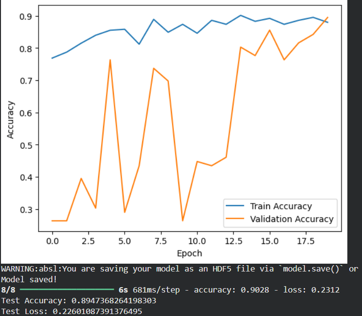

# 👁️ Cataract Detection App

A deep-learning powered web application that detects **cataract** from eye images using a custom **Mini-ResNet** model.  
Built using **TensorFlow** and **Streamlit**.

---

## 🚀 Live Demo
👉 [Cataract Detection App](https://cataract-detection-app-ja69amujra57dzvsq2v5zj.streamlit.app)

---

## 📌 Project Overview

This project uses a custom Mini-ResNet convolutional neural network to classify eye images as:

- **Cataract**
- **Normal**

The model was trained on a curated dataset in Google Colab and integrated into an interactive Streamlit application where users can upload an image and instantly receive a prediction along with confidence.

---

## 🧠 Model Performance

### 📊 Accuracy Curve


### 📊 Confusion Matrix


---

## 🧠 Model Details

- Architecture: **Custom Mini-ResNet**
- Input Size: **256 × 256 × 3**
- Loss Function: **Binary Crossentropy**
- Optimizer: **Adam**
- Saved Model Format: **`.h5`**

Training code is provided inside the `src/` folder.

---

## 📝 Requirements

```
streamlit
tensorflow
numpy
pillow
matplotlib
scikit-learn
seaborn
opencv-python
```

These libraries are used for model training, preprocessing, and running the web app.

---

## 📸 App Screenshots

### 🏠 Home Page


### 🔍 Prediction Result


---

## ✨ Author
**Yeshee Agarwal**

Feel free to reach out for collaboration or suggestions!


